# Architecture Overview - Therapist Monthly Cancellation Reset System

## System Architecture Diagram

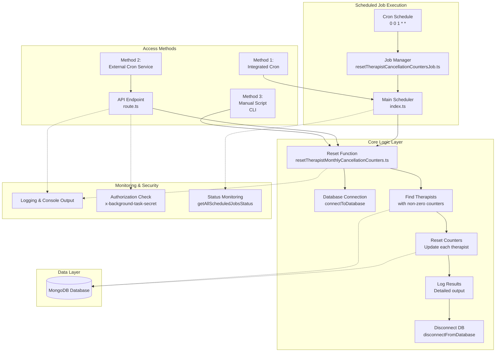

## Component Interaction Flow

### Monthly Execution Flow

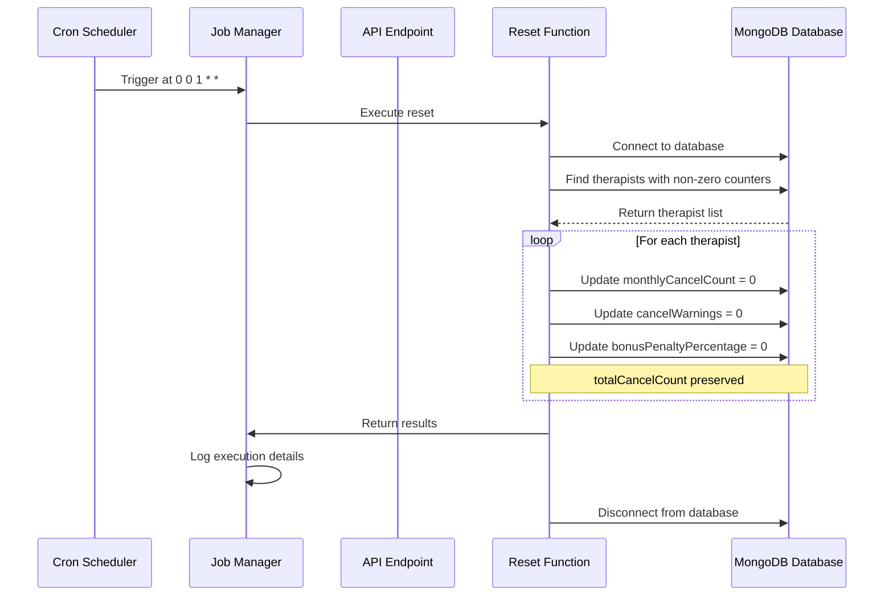

### API Request Flow (External Cron Service)

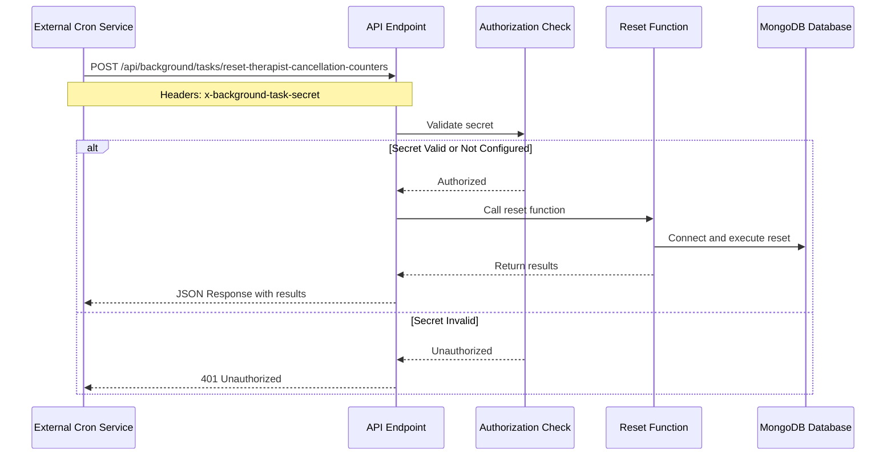

### Manual Execution Flow

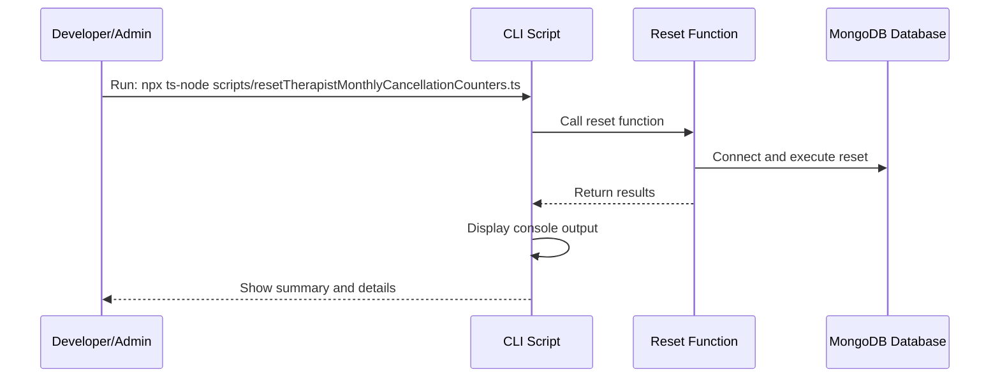

## Deployment Architecture Options

### Option A: Integrated Cron (Traditional Server)

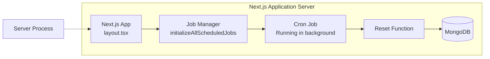

**Best for:** VPS, EC2, Docker containers, dedicated servers

---

### Option B: External Cron Service (Serverless)

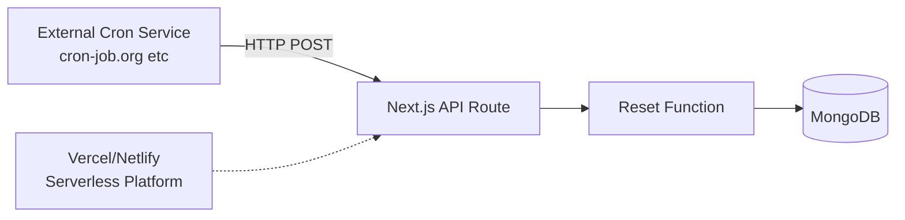

**Best for:** Vercel, Netlify, serverless functions

---

### Option C: Hybrid Approach

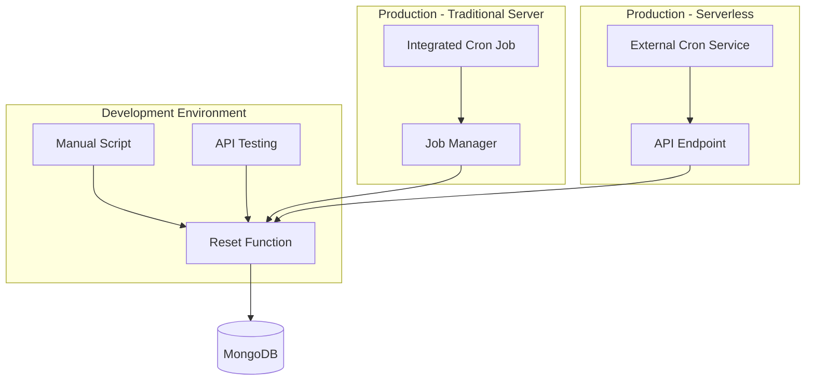

---

## Data Flow Diagram

### Reset Operation Data Flow

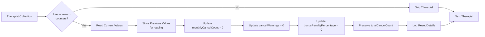

---

## State Transition Diagram

### Therapist Counter States

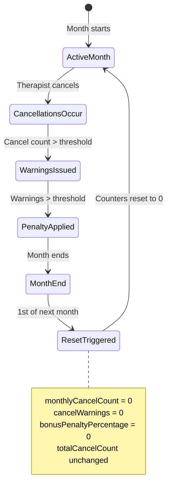

---

## Error Handling Flow

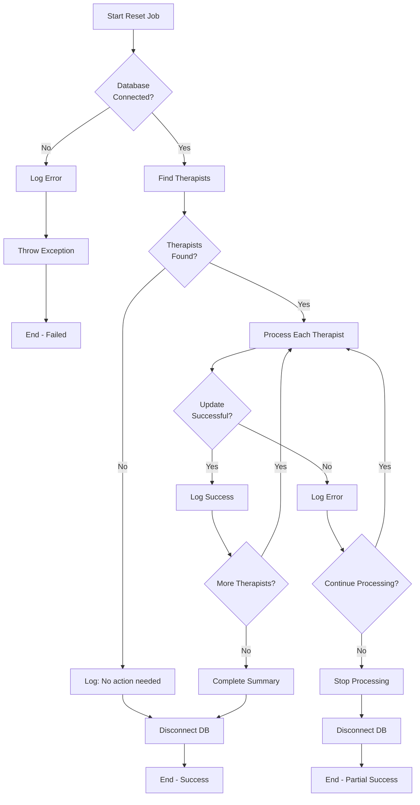

---

## Security Model

### API Authorization Flow

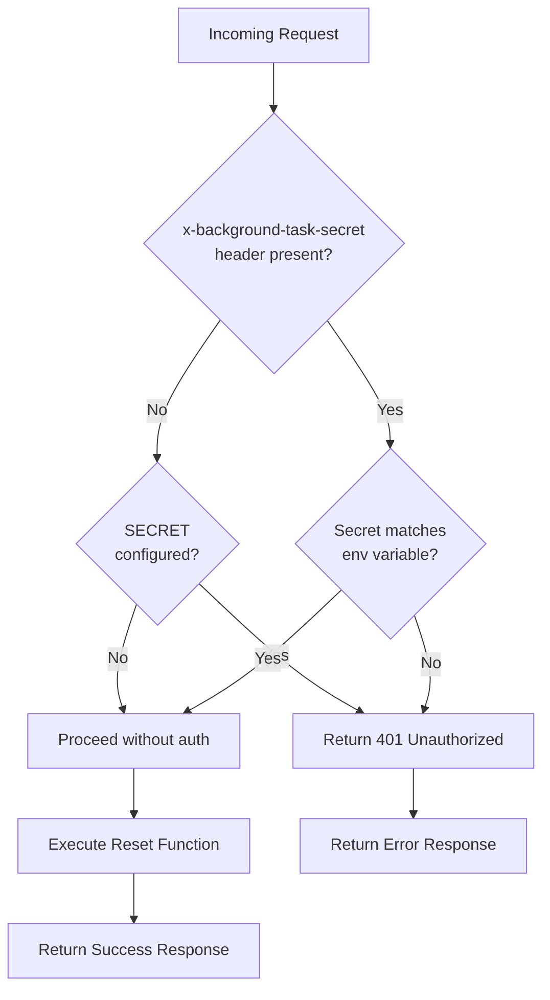

---

## Monitoring & Observability

### Logging Levels

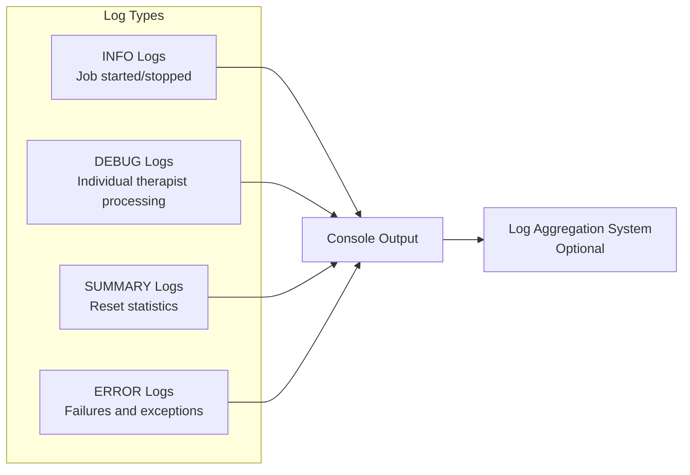

### Metrics to Monitor

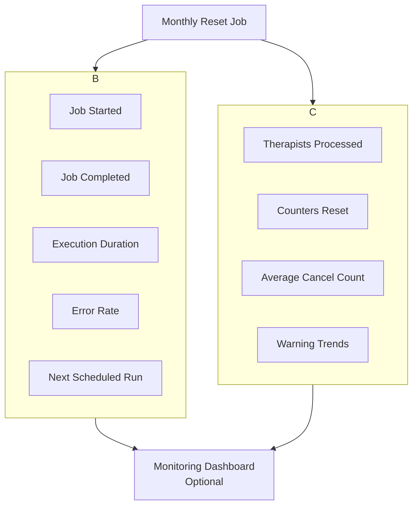

---

## File Structure

```
wellness-app/
├── utils/
│   ├── resetTherapistMonthlyCancellationCounters.ts    # Core reset logic
│   └── scheduledJobs/
│       ├── index.ts                                     # Main job manager
│       └── resetTherapistCancellationCountersJob.ts    # Specific job
├── app/
│   └── api/
│       └── background/
│           └── tasks/
│               └── reset-therapist-cancellation-counters/
│                   └── route.ts                         # API endpoint
├── scripts/
│   ├── resetTherapistMonthlyCancellationCounters.ts    # Manual script
│   └── test-resetTherapistCancellation.ts              # Test suite
├── package.json                                         # Dependencies
└── .env.local                                           # Environment vars
```

---

## Timeline View

### Monthly Execution Timeline

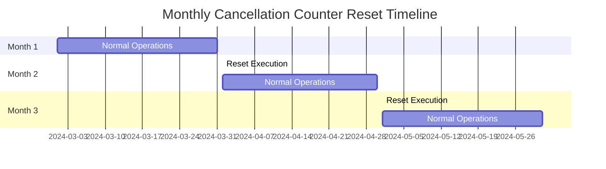

### Job Execution Timeline (Detailed)

```mermaid
gantt
    title Single Reset Job Execution (Not to Scale)
    dateFormat  X
    axisFormat %s
    
    section Setup
    Initialize Job        :0, 1
    Connect to DB         :1, 2
    
    section Processing
    Find Therapists       :2, 5
    Process Therapist 1   :5, 10
    Process Therapist 2   :10, 15
    Process Therapist N   :15, 20
    
    section Cleanup
    Generate Summary      :20, 22
    Disconnect DB         :22, 23
    Log Results           :23, 25
```

---

## Decision Points

### Implementation Choices Made

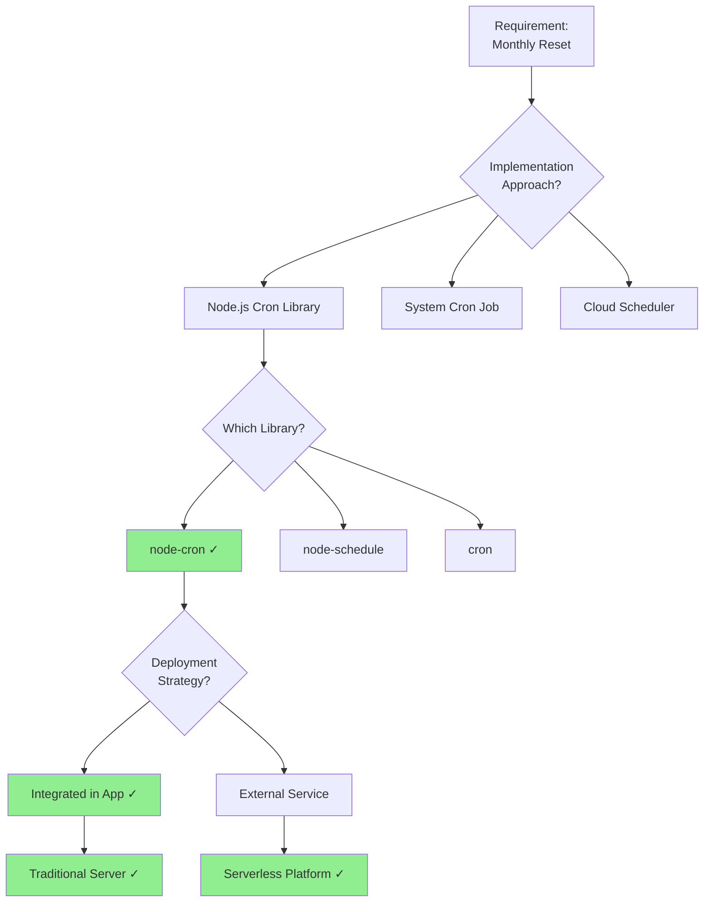

---

## Summary

This architecture provides:

✅ **Flexibility**: Multiple deployment options  
✅ **Reliability**: Error handling and isolation  
✅ **Observability**: Comprehensive logging  
✅ **Security**: Optional authorization  
✅ **Maintainability**: Clean separation of concerns  
✅ **Scalability**: Can handle any number of therapists  

Choose the deployment option that best fits your infrastructure!
