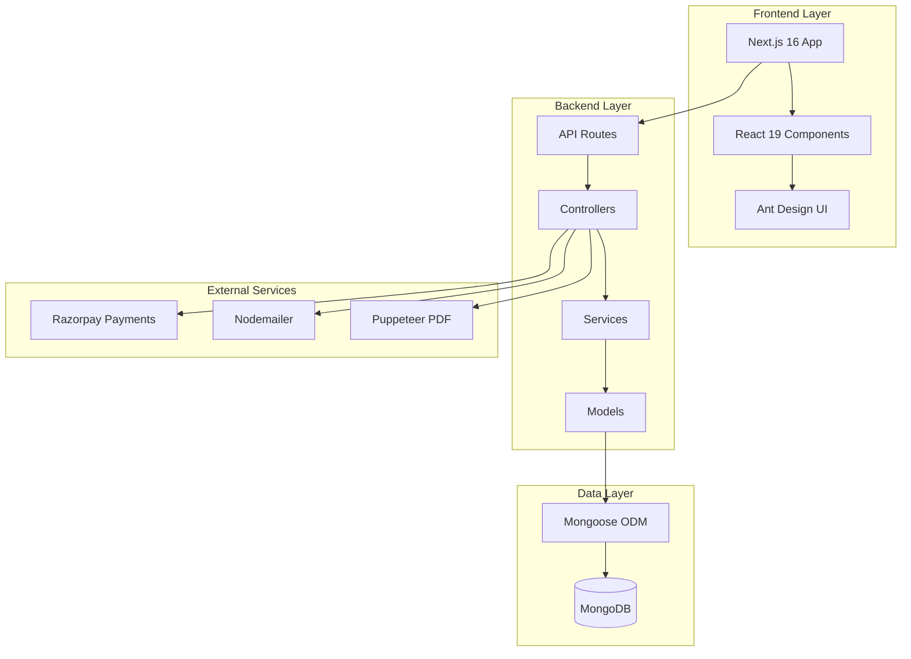
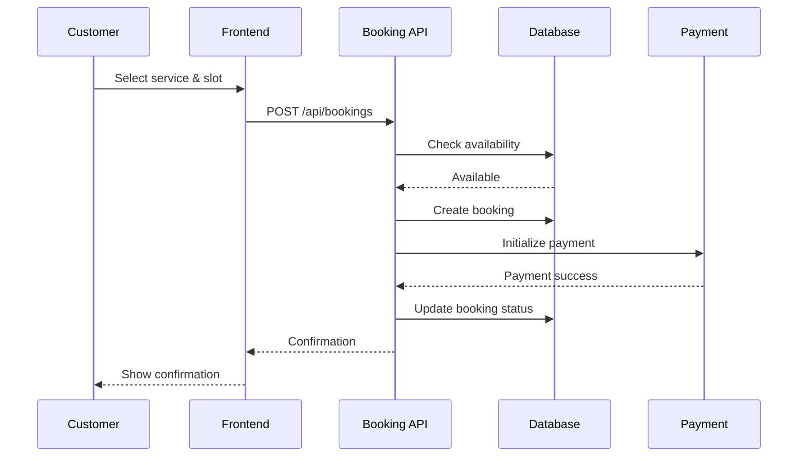
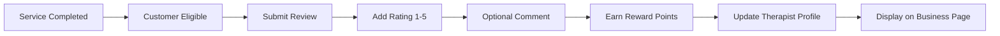
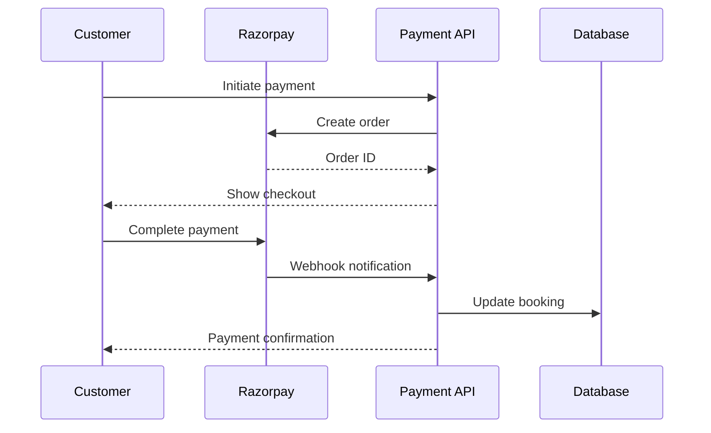
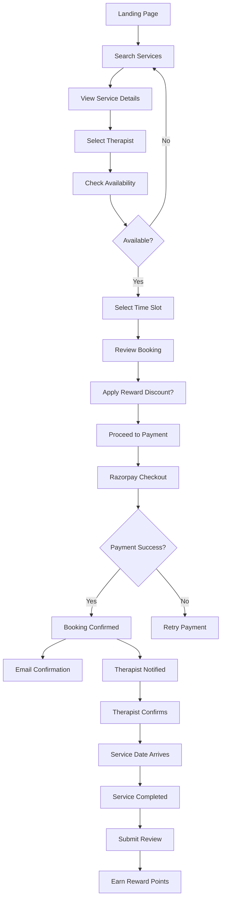
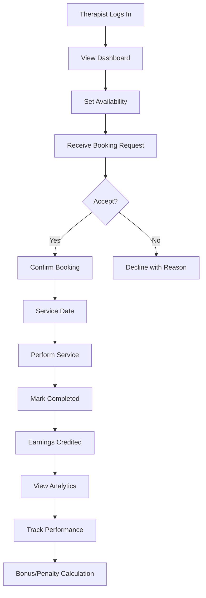
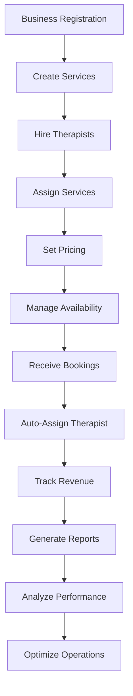
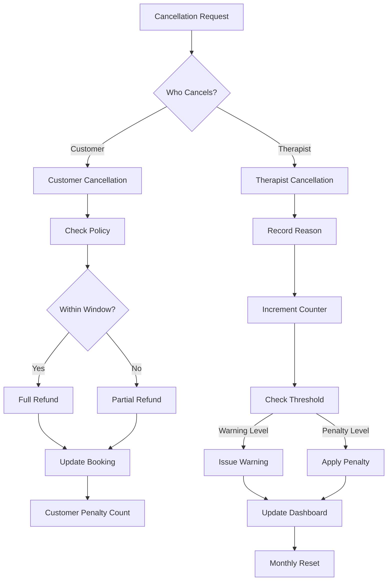
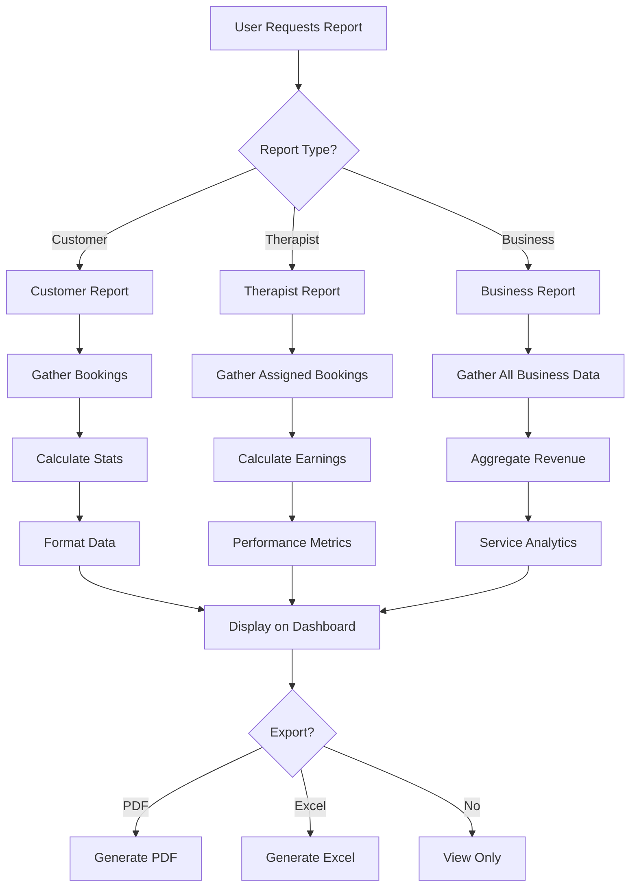
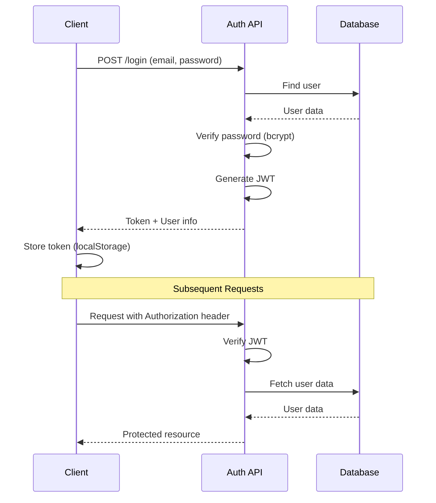

# 🌿 Serenity Wellness Platform - Complete System Overview

**Version:** 1.0  
**Last Updated:** March 23, 2026  
**Platform Type:** Full-Stack Spa & Wellness Management System

---

## 📋 Table of Contents

1. [System Architecture](#system-architecture)
2. [Technology Stack](#technology-stack)
3. [User Roles & Dashboards](#user-roles--dashboards)
4. [Core Features](#core-features)
5. [Complete User Flows](#complete-user-flows)
6. [API Structure](#api-structure)
7. [Database Models](#database-models)
8. [Reporting System](#reporting-system)
9. [Payment & Rewards](#payment--rewards)
10. [Cancellation Management](#cancellation-management)
11. [Scheduled Jobs](#scheduled-jobs)

---

## 🏗️ System Architecture



### Architecture Highlights

- **Framework:** Next.js 16 with App Router
- **Rendering:** Hybrid SSR/CSR with React Server Components
- **Authentication:** JWT-based with middleware protection
- **Database:** MongoDB with Mongoose ORM
- **State Management:** React Context API
- **UI Framework:** Ant Design + Tailwind CSS

---

## 💻 Technology Stack

### Frontend
| Technology | Version | Purpose |
|------------|---------|---------|
| Next.js | 16.1.1 | React Framework |
| React | 19.2.3 | UI Library |
| TypeScript | 5.x | Type Safety |
| Ant Design | 6.1.4 | Component Library |
| Tailwind CSS | 4.1.18 | Utility CSS |
| Recharts | 3.7.0 | Data Visualization |
| Axios | 1.13.2 | HTTP Client |

### Backend
| Technology | Version | Purpose |
|------------|---------|---------|
| Node.js | Latest | Runtime |
| Express | Built-in | Web Framework |
| MongoDB | 7.x | Database |
| Mongoose | 9.1.2 | ODM |
| JWT | 9.0.3 | Authentication |
| bcryptjs | 3.0.3 | Password Hashing |
| Nodemailer | 7.0.12 | Email Service |
| node-cron | 3.0.3 | Scheduled Jobs |

### External Services
| Service | Purpose |
|---------|---------|
| Razorpay | Payment Processing |
| Puppeteer | PDF Generation |
| ExcelJS | Excel Report Generation |

---

## 👥 User Roles & Dashboards

### 1. **Customers**
**Dashboard:** `/dashboard/customer`

**Features:**
- Browse and search spa services
- Book appointments with therapists
- View booking history
- Submit reviews and ratings
- Earn and redeem reward points
- View payment history
- Manage profile
- Access detailed reports

**Key Pages:**
- `/dashboard/customer` - Main dashboard
- `/dashboard/customer/bookings` - Booking management
- `/dashboard/customer/payments` - Payment history
- `/dashboard/customer/reports` - Personal reports
- `/dashboard/customer/analytics` - Usage analytics
- `/dashboard/customer/profile` - Profile settings

---

### 2. **Therapists (Service Providers)**
**Dashboard:** `/dashboard/therapist`

**Features:**
- Manage availability schedule
- View assigned bookings
- Track earnings and performance
- Access detailed analytics
- View customer reviews
- Generate custom reports
- Track cancellations
- Monitor bonus/penalty metrics

**Key Pages:**
- `/dashboard/therapist` - Main dashboard
- `/dashboard/therapist/earnings` - Earnings breakdown
- `/dashboard/therapist/reports` - Custom reports
- `/dashboard/therapist/analytics` - Performance metrics
- `/dashboard/therapist/reviews` - Customer reviews
- `/dashboard/therapist/profile` - Profile management

---

### 3. **Businesses (Spa Providers)**
**Dashboard:** `/dashboard/business`

**Features:**
- Manage service catalog
- Assign therapists to services
- View business analytics
- Track revenue and bookings
- Manage therapist assignments
- Access business reports
- Monitor cancellation performance
- View customer reviews

**Key Pages:**
- `/dashboard/business` - Main dashboard
- `/dashboard/business/earning` - Revenue tracking
- `/dashboard/business/reports` - Business reports
- `/dashboard/business/cancellation-performance` - Cancellation metrics
- `/dashboard/business/reviews` - Review management

---

### 4. **Administrators**
**Access:** Admin routes and utilities

**Features:**
- System-wide monitoring
- User management
- Master data management
- Background job control
- API testing endpoints
- Debug utilities

---

## ✨ Core Features

### 1. **Booking Management System**

**Flow:** Customer → Search → Select Service → Choose Therapist → Pick Slot → Confirm → Pay



**Booking States:**
- `pending` - Awaiting confirmation
- `confirmed` - Confirmed by therapist/business
- `completed` - Service delivered
- `cancelled` - Cancelled (by customer/therapist)
- `expired` - Auto-cancelled if not confirmed

**Key Files:**
- Controller: `controllers/bookingController.js`
- Model: `models/Booking.ts`
- Routes: `app/api/bookings/`

---

### 2. **Therapist Management**

**Features:**
- Profile management with certifications
- Availability scheduling
- Service assignments
- Performance tracking
- Bonus/penalty calculation

**Availability Management:**
```typescript
// Set weekly recurring availability
{
  therapistId: "xxx",
  availability: [
    { day: "Monday", slots: ["09:00-10:00", "10:00-11:00"] },
    { day: "Tuesday", slots: ["14:00-15:00"] }
  ]
}
```

**Cancellation Tracking:**
- Monthly counter resets on 1st of each month
- Automatic bonus/penalty calculation
- Warning system for excessive cancellations
- Performance impact on earnings

**Key Files:**
- Model: `models/Therapist.ts`
- Availability: `models/TherapistAvailability.ts`
- Bonus: `models/TherapistBonus.ts`
- Reset Job: `utils/resetTherapistMonthlyCancellationCounters.ts`

---

### 3. **Service Catalog**

**Structure:**
```
Business
├── Service Categories
│   ├── Massage Therapy
│   ├── Aromatherapy
│   └── Deep Tissue
└── Services
    ├── Swedish Massage (₹2000)
    └── Hot Stone Therapy (₹3500)
```

**Service Model Fields:**
- `name` - Service name
- `price` - Base price
- `duration` - Session length
- `description` - Service details
- `business` - Associated business
- `category` - Service category
- `assignedTherapists` - Qualified therapists

**Key Files:**
- Model: `models/Service.ts`
- Category: `models/ServiceCategory.ts`

---

### 4. **Review & Rating System**

**Flow:**


**Reward Points:**
- Points per review: Configurable (default: 10 points)
- Maximum per month: Limited
- Anti-spam: One review per service

**Key Files:**
- Controller: `controllers/reviewController.js`
- Model: `models/Review.ts`

---

### 5. **Payment System**

**Payment Flow:**


**Payment Model Fields:**
- `bookingId` - Linked booking
- `amount` - Total amount
- `status` - pending/completed/failed/refunded
- `paymentMethod` - card/upi/netbanking
- `razorpayOrderId`, `razorpayPaymentId`, `razorpaySignature`
- `discountApplied` - Reward discount if any
- `finalAmount` - After discount

**Key Files:**
- Model: `models/Payment.ts`
- Integration: `app/api/payments/`

---

### 6. **Rewards & Loyalty Program**

**Earning Points:**
| Activity | Points |
|----------|--------|
| Submit Review | 10 |
| Complete Booking | 5 |
| First-time User | 50 |
| Referral | 100 |

**Redeeming Points:**
- 100 points = 10% discount
- Auto-applied at checkout
- Resets after usage

**Reward History Tracking:**
```typescript
{
  type: "REVIEW_REWARD" | "BOOKING_REWARD" | "DISCOUNT_USED",
  points: 10,
  description: "Reward for submitting review",
  timestamp: Date
}
```

**Key Files:**
- Utils: `utils/rewardUtils.js`
- Integration: `controllers/bookingController.js`

---

## 🔄 Complete User Flows

### Flow 1: Customer Booking Journey



**Detailed Steps:**

1. **Discovery Phase**
   - Customer visits homepage
   - Searches for services by category
   - Filters by price, rating, availability
   - Views therapist profiles

2. **Booking Phase**
   - Selects desired service
   - Chooses preferred therapist (or auto-assign)
   - Views available time slots
   - Selects date and time
   - Reviews booking summary

3. **Payment Phase**
   - System checks reward point eligibility
   - Applies 10% discount if eligible (100+ points)
   - Initializes Razorpay payment
   - Customer completes payment
   - System creates booking record

4. **Confirmation Phase**
   - Therapist receives notification
   - Therapist confirms booking
   - Customer receives confirmation email
   - Booking appears in both dashboards

5. **Service Delivery**
   - Customer arrives for appointment
   - Therapist marks service as started
   - Upon completion, marks as completed
   - Payment released to business

6. **Post-Service**
   - Customer submits review
   - Earns reward points
   - Review appears on therapist/business profile
   - Points accumulate for future discounts

---

### Flow 2: Therapist Workflow



**Detailed Steps:**

1. **Onboarding**
   - Business creates therapist profile
   - Therapist sets credentials
   - Uploads certifications
   - Defines availability schedule

2. **Daily Operations**
   - Logs into dashboard
   - Reviews upcoming bookings
   - Manages availability
   - Responds to requests

3. **Service Delivery**
   - Receives booking notification
   - Reviews customer requirements
   - Prepares for session
   - Performs service
   - Updates booking status

4. **Performance Tracking**
   - Views earnings dashboard
   - Monitors cancellation rate
   - Tracks customer ratings
   - Accesses detailed reports

5. **Monthly Cycle**
   - Cancellation counters tracked
   - Performance metrics calculated
   - Bonus/penalty applied
   - Counters reset on 1st

---

### Flow 3: Business Operations



**Detailed Steps:**

1. **Setup Phase**
   - Register business account
   - Create service categories
   - Define individual services
   - Set pricing and duration

2. **Staff Management**
   - Hire therapists
   - Verify credentials
   - Assign services to therapists
   - Manage schedules

3. **Operations**
   - Monitor incoming bookings
   - Auto-assign based on availability
   - Track service delivery
   - Handle issues/disputes

4. **Analytics**
   - View revenue dashboard
   - Track popular services
   - Monitor therapist performance
   - Analyze customer trends

5. **Reporting**
   - Generate monthly reports
   - Export to PDF/Excel
   - Review financial summaries
   - Plan improvements

---

### Flow 4: Cancellation Management



**Cancellation Rules:**

**Customer Cancellations:**
- Free cancellation up to 24 hours before
- 50% refund within 24 hours
- No refund for no-show
- Penalty tracking for frequent cancellations

**Therapist Cancellations:**
- Must provide valid reason
- Counts toward monthly limit
- Warnings issued at thresholds
- Penalties affect bonus percentage

**Monthly Reset Process:**
- Runs on 1st of every month
- Resets `monthlyCancelCount` to 0
- Resets `cancelWarnings` to 0
- Resets `bonusPenaltyPercentage` to 0
- Preserves `totalCancelCount` for history

**Key Files:**
- Reset Logic: `utils/resetTherapistMonthlyCancellationCounters.ts`
- Scheduled Job: `utils/scheduledJobs/resetTherapistCancellationCountersJob.ts`
- API Endpoint: `app/api/background/tasks/reset-therapist-cancellation-counters/route.ts`

---

### Flow 5: Report Generation



**Report Types:**

**Customer Report:**
- Total bookings
- Completed vs cancelled
- Total spent
- Discount used
- Most booked service
- Recent booking history

**Therapist Report:**
- Total bookings handled
- Completed vs cancelled
- Total earnings (70% of service price)
- Services performed
- Monthly cancellation count
- Bonus/penalty percentage
- Customer ratings
- Custom field selection

**Business Report:**
- Total services offered
- Total therapists
- Booking statistics
- Revenue breakdown
- Most popular services
- Top performing therapists
- Monthly revenue trends

**Export Options:**
- PDF: Formatted report via Puppeteer
- Excel: Detailed data via ExcelJS
- JSON: API response for frontend

**Key Files:**
- Controller: `controllers/reportController.js`
- Service: `services/reportService.js`
- PDF Generator: `utils/pdfGenerator.ts`
- Excel Generator: `utils/excelGenerator.ts`

---

## 🔌 API Structure

### Authentication APIs
```
POST   /api/auth/register          - Register new user
POST   /api/auth/login             - Login user
POST   /api/auth/logout            - Logout user
GET    /api/auth/me                - Get current user
POST   /api/auth/forgot-password   - Request password reset
POST   /api/auth/reset-password    - Reset password with token
```

### Booking APIs
```
POST   /api/bookings               - Create booking
GET    /api/bookings/:id           - Get booking by ID
PUT    /api/bookings/:id           - Update booking
DELETE /api/bookings/:id           - Cancel booking
GET    /api/bookings/customer/:id  - Get customer bookings
GET    /api/bookings/therapist/:id - Get therapist bookings
POST   /api/bookings/:id/confirm   - Confirm booking
POST   /api/bookings/:id/complete  - Complete booking
```

### Service APIs
```
GET    /api/services               - List all services
POST   /api/services               - Create service
GET    /api/services/:id           - Get service details
PUT    /api/services/:id           - Update service
DELETE /api/services/:id           - Delete service
GET    /api/service-categories     - List categories
```

### Therapist APIs
```
GET    /api/therapists             - List therapists
GET    /api/therapists/:id         - Get therapist profile
PUT    /api/therapists/:id         - Update profile
GET    /api/therapists/:id/availability - Get availability
PUT    /api/therapists/:id/availability - Set availability
GET    /api/therapists/:id/reports - Get therapist reports
GET    /api/therapists/:id/earnings - Get earnings data
```

### Business APIs
```
GET    /api/businesses             - List businesses
POST   /api/businesses             - Create business
GET    /api/businesses/:id         - Get business details
PUT    /api/businesses/:id         - Update business
GET    /api/businesses/:id/services - Get business services
GET    /api/businesses/:id/therapists - Get associated therapists
GET    /api/businesses/:id/reports - Get business reports
```

### Customer APIs
```
GET    /api/customers/:id          - Get customer profile
PUT    /api/customers/:id          - Update profile
GET    /api/customers/:id/bookings - Get customer bookings
GET    /api/customers/:id/payments - Get payment history
GET    /api/customers/:id/reports  - Get customer reports
```

### Review APIs
```
POST   /api/reviews                - Submit review
GET    /api/reviews/service/:id    - Get service reviews
GET    /api/reviews/customer/:id   - Get customer reviews
GET    /api/reviews/therapist/:id  - Get therapist reviews
```

### Payment APIs
```
POST   /api/payments/create-order  - Create Razorpay order
POST   /api/payments/verify        - Verify payment signature
GET    /api/payments/:id           - Get payment details
GET    /api/customers/:id/payments - Get customer payments
```

### Report APIs
```
GET    /api/reports/customer       - Get customer report
GET    /api/reports/business       - Get business report
GET    /api/reports/therapist      - Get therapist report
GET    /api/reports/therapist/custom - Get custom therapist report
GET    /api/reports/:type/pdf      - Generate PDF report
GET    /api/reports/:type/excel    - Generate Excel report
```

### Background Task APIs
```
POST   /api/background/tasks/reset-therapist-cancellation-counters - Reset counters
GET    /api/background/tasks/status - Get job status
```

---

## 🗄️ Database Models

### User Model
```typescript
interface User {
  _id: ObjectId
  name: string
  email: string
  password: string // Hashed
  role: 'customer' | 'therapist' | 'business' | 'admin'
  phone?: string
  rewardPoints: number
  rewardHistory: RewardEntry[]
  createdAt: Date
  updatedAt: Date
}
```

### Customer Model (extends User)
```typescript
interface Customer extends User {
  role: 'customer'
  bookings: Booking[]
  reviews: Review[]
  preferences?: {
    favoriteServices?: ObjectId[]
    favoriteTherapists?: ObjectId[]
  }
}
```

### Therapist Model (extends User)
```typescript
interface Therapist extends User {
  role: 'therapist'
  fullName: string
  bio?: string
  certifications: string[]
  specialties: string[]
  experience: number
  rating: number
  totalReviews: number
  businessAssociations: {
    businessId: ObjectId
    startDate: Date
    endDate?: Date
    servicesAssigned: ObjectId[]
  }[]
  availability: TherapistAvailability[]
  monthlyCancelCount: number
  totalCancelCount: number
  cancelWarnings: number
  bonusPenaltyPercentage: number
  lastResetDate: Date
}
```

### Business Model
```typescript
interface Business {
  _id: ObjectId
  name: string
  email: string
  password: string
  businessName: string
  address: {
    street: string
    city: string
    state: string
    zipCode: string
    country: string
  }
  phone: string
  licenseNumber?: string
  services: ObjectId[]
  therapists: ObjectId[]
  operatingHours: {
    day: string
    openTime: string
    closeTime: string
  }[]
  rating: number
  createdAt: Date
  updatedAt: Date
}
```

### Service Model
```typescript
interface Service {
  _id: ObjectId
  name: string
  description: string
  price: number
  duration: number // minutes
  category?: ObjectId
  business: ObjectId
  assignedTherapists: ObjectId[]
  isActive: boolean
  createdAt: Date
  updatedAt: Date
}
```

### Booking Model
```typescript
interface Booking {
  _id: ObjectId
  customer: ObjectId
  service: ObjectId
  therapist: ObjectId
  date: Date
  time: string
  status: 'pending' | 'confirmed' | 'completed' | 'cancelled' | 'expired'
  finalPrice: number
  originalPrice: number
  discountApplied: number
  rewardDiscountApplied: boolean
  paymentStatus: 'pending' | 'paid' | 'refunded' | 'failed'
  cancellationReason?: string
  cancelledBy?: 'customer' | 'therapist' | 'business'
  cancelledAt?: Date
  customerCancelReason?: string
  therapistCancelReason?: string
  notes?: string
  createdAt: Date
  updatedAt: Date
}
```

### Review Model
```typescript
interface Review {
  _id: ObjectId
  customerId: ObjectId
  serviceId: ObjectId
  therapistId?: ObjectId
  rating: number // 1-5
  comment?: string
  createdAt: Date
}
```

### Payment Model
```typescript
interface Payment {
  _id: ObjectId
  bookingId: ObjectId
  amount: number
  status: 'pending' | 'completed' | 'failed' | 'refunded'
  paymentMethod: 'card' | 'upi' | 'netbanking' | 'wallet'
  razorpayOrderId: string
  razorpayPaymentId?: string
  razorpaySignature?: string
  discountApplied: number
  finalAmount: number
  createdAt: Date
  updatedAt: Date
}
```

---

## 📊 Reporting System

### Customer Reports

**Data Sources:**
- Booking collection
- Payment records
- Review submissions

**Metrics Calculated:**
```javascript
{
  totalBookings: count(bookings),
  completedBookings: count(status === 'completed'),
  cancelledBookings: count(status === 'cancelled'),
  totalSpent: sum(finalPrice),
  totalDiscountUsed: sum(discountApplied),
  mostBookedService: mode(service.name),
  recentBookings: slice(bookings, 0, 5)
}
```

**Implementation:**
- File: `services/reportService.js` (lines 13-132)
- Endpoint: `/api/reports/customer`
- Frontend: `app/dashboard/customer/reports/`

---

### Therapist Reports

**Standard Report Fields:**
1. `totalBookings` - All bookings assigned
2. `completedBookings` - Successfully completed
3. `cancelledBookings` - Cancelled bookings
4. `totalEarnings` - Sum of 70% of completed booking prices
5. `totalServicesDone` - Unique services performed
6. `monthlyCancelCount` - Cancellations this month
7. `bonusPenaltyPercentage` - Based on cancellation rate
8. `recentBookings` - Last 10 bookings
9. `monthlyRevenue` - Month-by-month earnings breakdown
10. `serviceBreakdown` - Stats per service type

**Custom Report Selection:**
- Therapists can select which fields to include
- Dynamic report generation
- Reduces data overload
- Focus on relevant metrics

**Implementation:**
- File: `services/reportService.js` (lines 376-692)
- Endpoint: `/api/reports/therapist/custom`
- Frontend: `app/dashboard/therapist/reports/`

---

### Business Reports

**Metrics:**
```javascript
{
  totalServices: count(services),
  totalTherapists: count(therapists),
  totalBookings: count(all service bookings),
  completedBookings: count(status === 'completed'),
  cancelledBookings: count(status === 'cancelled'),
  totalRevenue: sum(finalPrice for completed),
  mostBookedService: mode(service.name),
  topTherapist: max(bookings per therapist),
  monthlyRevenue: [{month, revenue}]
}
```

**Implementation:**
- File: `services/reportService.js` (lines 139-264)
- Endpoint: `/api/reports/business`
- Frontend: `app/dashboard/business/reports/`

---

### PDF Generation

**Process:**
1. Fetch report data from service
2. Create HTML template with embedded data
3. Launch headless Chrome via Puppeteer
4. Render HTML to PDF
5. Return as downloadable file

**Template Features:**
- Professional formatting
- Charts and graphs
- Tables with detailed data
- Company branding
- Timestamp and metadata

**Implementation:**
- File: `utils/pdfGenerator.ts`
- Uses: Puppeteer, Chromium browser

---

### Excel Generation

**Process:**
1. Fetch report data
2. Create workbook with multiple sheets
3. Format cells and columns
4. Add formulas for calculations
5. Apply styling
6. Export as .xlsx

**Sheet Structure:**
- Summary sheet with key metrics
- Detailed data sheets
- Charts and visualizations
- Pivot tables (optional)

**Implementation:**
- File: `utils/excelGenerator.ts`
- Uses: ExcelJS library

---

## 💰 Payment & Rewards

### Payment Processing Flow

**Step-by-Step:**

1. **Order Creation**
   ```javascript
   const options = {
     amount: finalPrice * 100, // paise
     currency: "INR",
     receipt: bookingId,
     notes: { customerId, serviceId }
   };
   const order = await razorpay.orders.create(options);
   ```

2. **Frontend Checkout**
   - Display Razorpay modal
   - Customer selects payment method
   - Enters payment details
   - Completes authentication

3. **Payment Verification**
   ```javascript
   const signatureValid = crypto
     .createHmac("sha256", secret)
     .update(orderId + "|" + paymentId)
     .digest("hex");
   
   if (signatureValid === signature) {
     // Mark booking as paid
   }
   ```

4. **Database Update**
   - Update booking.paymentStatus = 'paid'
   - Create payment record
   - Send confirmation email

**Key Files:**
- Integration: `app/api/payments/`
- Model: `models/Payment.ts`

---

### Reward System Mechanics

**Point Accumulation:**

```javascript
// utils/rewardUtils.js
const REWARD_POINTS_PER_REVIEW = 10;
const REWARD_POINTS_PER_BOOKING = 5;
const DISCOUNT_THRESHOLD = 100; // Points needed
const DISCOUNT_PERCENTAGE = 10; // 10% off

function calculateUpdatedPoints(currentPoints) {
  return Math.min(currentPoints + REWARD_POINTS_PER_REVIEW, 200); // Cap at 200
}

function checkRewardDiscount(customer) {
  return customer.rewardPoints >= DISCOUNT_THRESHOLD;
}

function calculateDiscountedPrice(originalPrice) {
  const discount = originalPrice * (DISCOUNT_PERCENTAGE / 100);
  return {
    discount,
    finalPrice: originalPrice - discount
  };
}
```

**Usage Flow:**

1. Customer has 100+ points
2. Creates booking
3. System checks eligibility
4. Applies 10% discount automatically
5. Resets points to 0
6. Records discount in reward history
7. Shows savings to customer

**Anti-Abuse Measures:**
- One discount per booking
- Points capped at 200
- Review rewards limited per month
- Fraud detection algorithms

**Tracking:**
```typescript
interface RewardEntry {
  type: 'REVIEW_REWARD' | 'BOOKING_REWARD' | 'DISCOUNT_USED' | 'REFERRAL';
  points: number;
  description: string;
  timestamp: Date;
  relatedEntity?: ObjectId; // bookingId, reviewId, etc.
}
```

---

## 🚫 Cancellation Management

### Customer Cancellation Flow

**Policy Enforcement:**

```javascript
function handleCustomerCancellation(booking) {
  const now = new Date();
  const serviceDate = new Date(booking.date + 'T' + booking.time);
  const hoursUntilService = (serviceDate - now) / (1000 * 60 * 60);
  
  if (hoursUntilService >= 24) {
    // Full refund
    refundAmount = booking.finalPrice;
    penalty = false;
  } else if (hoursUntilService > 2) {
    // Partial refund (50%)
    refundAmount = booking.finalPrice * 0.5;
    penalty = true;
  } else {
    // No refund
    refundAmount = 0;
    penalty = true;
  }
  
  // Update booking
  booking.status = 'cancelled';
  booking.cancelledBy = 'customer';
  booking.cancellationReason = req.body.reason;
  booking.cancelledAt = now;
  
  // Track penalty
  if (penalty) {
    incrementCustomerCancelCount(booking.customer);
  }
  
  // Process refund
  processRefund(booking, refundAmount);
}
```

**Customer Impact:**
- Frequent cancellations may trigger warnings
- Account review after threshold
- Possible restrictions on booking

---

### Therapist Cancellation Flow

**Tracking System:**

```typescript
interface Therapist {
  monthlyCancelCount: number;      // Current month
  totalCancelCount: number;        // Lifetime
  cancelWarnings: number;          // Active warnings
  bonusPenaltyPercentage: number;  // Current month adjustment
  lastResetDate: Date;             // Last monthly reset
}
```

**Threshold System:**

| Monthly Cancellations | Action |
|----------------------|--------|
| 1-2 | No action |
| 3-4 | Warning issued |
| 5-6 | 5% penalty on earnings |
| 7+ | 10% penalty + review |

**Monthly Reset:**

```javascript
// Runs on 1st of every month
async function resetTherapistMonthlyCancellationCounters() {
  const therapists = await Therapist.find({
    $or: [
      { monthlyCancelCount: { $gt: 0 } },
      { cancelWarnings: { $gt: 0 } },
      { bonusPenaltyPercentage: { $ne: 0 } }
    ]
  });
  
  for (const therapist of therapists) {
    // Store previous values for logging
    const prev = {
      monthlyCancelCount: therapist.monthlyCancelCount,
      cancelWarnings: therapist.cancelWarnings,
      bonusPenaltyPercentage: therapist.bonusPenaltyPercentage
    };
    
    // Reset counters
    therapist.monthlyCancelCount = 0;
    therapist.cancelWarnings = 0;
    therapist.bonusPenaltyPercentage = 0;
    therapist.lastResetDate = new Date();
    
    await therapist.save();
    
    console.log(`Reset therapist ${therapist._id}:`, prev);
  }
}
```

**Implementation Schedule:**
- Cron: `0 0 1 * *` (Midnight, 1st of month)
- Alternative: External cron service
- Manual: CLI script available

**Files:**
- Core Logic: `utils/resetTherapistMonthlyCancellationCounters.ts`
- Scheduled Job: `utils/scheduledJobs/resetTherapistCancellationCountersJob.ts`
- API Route: `app/api/background/tasks/reset-therapist-cancellation-counters/route.ts`
- Manual Script: `scripts/resetTherapistMonthlyCancellationCounters.ts`

---

## ⏰ Scheduled Jobs

### 1. Monthly Therapist Cancellation Reset

**Schedule:** `0 0 1 * *` (Monthly at midnight on 1st)

**Purpose:** Reset therapist cancellation counters to start fresh each month

**Execution Methods:**

**A. Integrated Cron (Development/Traditional Servers)**
```typescript
// utils/scheduledJobs/resetTherapistCancellationCountersJob.ts
import cron from 'node-cron';
import { resetTherapistMonthlyCancellationCounters } from '../resetTherapistMonthlyCancellationCounters';

export function initializeResetJob() {
  cron.schedule('0 0 1 * *', async () => {
    console.log('Running monthly therapist cancellation reset...');
    await resetTherapistMonthlyCancellationCounters();
  });
}
```

**B. External Cron Service (Serverless/Vercel)**
```typescript
// app/api/background/tasks/reset-therapist-cancellation-counters/route.ts
export async function POST(request: Request) {
  // Verify authorization
  const isAuthorized = verifyBackgroundTaskSecret(request);
  if (!isAuthorized) {
    return Response.json({ error: 'Unauthorized' }, { status: 401 });
  }
  
  // Execute reset
  const result = await resetTherapistMonthlyCancellationCounters();
  return Response.json({ success: true, result });
}
```

**C. Manual Execution**
```bash
# Development/Testing
npx ts-node scripts/resetTherapistMonthlyCancellationCounters.ts
```

**Monitoring:**
- Console logs on execution
- Detailed result object
- Error handling and notifications
- Status endpoint available

---

### 2. Expired Booking Cancellation

**Schedule:** `*/15 * * * *` (Every 15 minutes)

**Purpose:** Auto-cancel unconfirmed bookings older than 24 hours

**Logic:**
```javascript
async function cancelExpiredBookings() {
  const expiryThreshold = new Date(Date.now() - 24 * 60 * 60 * 1000);
  
  const expiredBookings = await Booking.find({
    status: 'pending',
    createdAt: { $lt: expiryThreshold }
  });
  
  for (const booking of expiredBookings) {
    booking.status = 'expired';
    booking.cancelledAt = new Date();
    await booking.save();
    
    // Release the slot
    await releaseTherapistSlot(booking);
    
    // Notify customer
    await sendCancellationEmail(booking.customer);
  }
}
```

**Implementation:**
- Script: `scripts/cancelExpiredBookings.ts`
- Integrated into job scheduler

---

## 🔐 Security Features

### Authentication

**JWT Token Flow:**


**Token Structure:**
```javascript
{
  userId: "ObjectId",
  email: "user@example.com",
  role: "customer",
  iat: 1234567890,
  exp: 1234654290  // 24 hours
}
```

**Middleware Protection:**
```typescript
// app/middleware/auth.ts
export function authMiddleware(req, res, next) {
  const token = req.headers.authorization?.split(' ')[1];
  
  if (!token) {
    return res.status(401).json({ error: 'No token provided' });
  }
  
  try {
    const decoded = jwt.verify(token, process.env.JWT_SECRET);
    req.user = decoded;
    next();
  } catch (error) {
    return res.status(401).json({ error: 'Invalid token' });
  }
}
```

---

### Authorization

**Role-Based Access Control (RBAC):**

```javascript
const permissions = {
  customer: ['read:own', 'write:own', 'create:booking'],
  therapist: ['read:own', 'write:own', 'read:assigned_bookings'],
  business: ['read:own', 'write:own', 'manage:services', 'manage:therapists'],
  admin: ['read:all', 'write:all', 'delete:all']
};

function authorize(requiredPermission) {
  return (req, res, next) => {
    const userRole = req.user.role;
    const allowed = permissions[userRole].includes(requiredPermission);
    
    if (!allowed) {
      return res.status(403).json({ error: 'Forbidden' });
    }
    
    next();
  };
}
```

**Example Usage:**
```typescript
// Only business owner can update their business
app.put('/api/businesses/:id', 
  authMiddleware, 
  authorize('write:own'),
  async (req, res) => {
    // Update business logic
  }
);
```

---

### Data Validation

**Input Sanitization:**
```typescript
import { isValidObjectId } from 'mongoose';

function validateBookingInput(data) {
  const errors = [];
  
  // Validate ObjectId format
  if (!isValidObjectId(data.customerId)) {
    errors.push('Invalid customer ID');
  }
  
  // Validate date format
  if (isNaN(Date.parse(data.date))) {
    errors.push('Invalid date');
  }
  
  // Validate time format
  if (!/^\d{2}:\d{2}$/.test(data.time)) {
    errors.push('Invalid time format');
  }
  
  // Validate required fields
  if (!data.serviceId) {
    errors.push('Service ID is required');
  }
  
  return {
    isValid: errors.length === 0,
    errors
  };
}
```

---

## 📈 Performance Optimizations

### Database Indexing

```javascript
// Recommended indexes
db.bookings.createIndex({ customerId: 1, createdAt: -1 });
db.bookings.createIndex({ therapistId: 1, date: 1 });
db.bookings.createIndex({ serviceId: 1, status: 1 });
db.bookings.createIndex({ status: 1, createdAt: -1 });

db.services.createIndex({ business: 1, category: 1 });
db.services.createIndex({ name: "text" });

db.therapists.createIndex({ "businessAssociations.businessId": 1 });
db.therapists.createIndex({ specialties: 1 });

db.users.createIndex({ email: 1 }, { unique: true });
db.users.createIndex({ role: 1 });
```

---

### Caching Strategy

**Redis Cache (Future Enhancement):**

```javascript
// Cache frequently accessed data
const CACHE_TTL = {
  SERVICE_LIST: 300,      // 5 minutes
  THERAPIST_AVAILABILITY: 60, // 1 minute
  BUSINESS_PROFILE: 600,  // 10 minutes
};

async function getServices(businessId) {
  const cacheKey = `services:${businessId}`;
  
  // Try cache first
  const cached = await redis.get(cacheKey);
  if (cached) {
    return JSON.parse(cached);
  }
  
  // Fetch from DB
  const services = await Service.find({ business: businessId });
  
  // Cache result
  await redis.setex(cacheKey, CACHE_TTL.SERVICE_LIST, JSON.stringify(services));
  
  return services;
}
```

---

### Query Optimization

**Population vs Manual Joins:**

```javascript
// ✅ Good: Selective population
Booking.find({ customerId })
  .populate('service', 'name price')
  .populate('therapist', 'fullName')
  .select('date time status finalPrice');

// ❌ Bad: Over-population
Booking.find({ customerId })
  .populate('service')
  .populate('therapist')
  .populate('customer'); // Already have customerId
```

**Lean Queries:**

```javascript
// For read-only operations
const bookings = await Booking.find({ customerId }).lean();
// Returns plain JS objects, faster and less memory
```

---

## 🧪 Testing Endpoints

### Available Test Routes

```
GET  /api-test                     - Test API health
GET  /auth-test                    - Test authentication
GET  /api/test-all-therapists      - List all therapists
GET  /api/test-businesses          - List test businesses
GET  /api/test-customer            - Test customer data
GET  /api/test-params              - Test parameter parsing
GET  /api/test-populate            - Test Mongoose populate
GET  /api/test-service-api         - Test service endpoints
GET  /api/test-therapist-fields    - Test therapist data
```

**Debug Pages:**

```
/about-us                          - Company information
/blog                              - Blog listings
/careers                           - Job postings
/help-center                       - FAQ and support
/privacy-policy                    - Privacy policy
/terms-of-service                  - Terms of service
/safety                            - Safety guidelines
```

---

## 📦 Deployment Guide

### Environment Variables

```env
# Database
MONGODB_URI=mongodb://localhost:27017/wellness-platform

# JWT Secret
JWT_SECRET=your-super-secret-key-change-in-production

# Razorpay
RAZORPAY_KEY_ID=rzp_test_xxxxx
RAZORPAY_KEY_SECRET=xxxxxxxxxx

# Email
SMTP_HOST=smtp.gmail.com
SMTP_PORT=587
SMTP_USER=your-email@gmail.com
SMTP_PASS=your-app-password

# Background Tasks
BACKGROUND_TASK_SECRET=optional-secret-for-api-auth

# App
NEXT_PUBLIC_APP_URL=https://your-domain.com
NODE_ENV=production
```

---

### Build & Run

**Development:**
```bash
cd wellness-app
npm install
npm run dev
# Opens at http://localhost:3000
```

**Production:**
```bash
npm run build
npm start
```

**Database Migration:**
```bash
npm run migrate-bookings
```

---

### Docker Deployment (Future)

```dockerfile
FROM node:18-alpine

WORKDIR /app

COPY package*.json ./
RUN npm ci --only=production

COPY . .
RUN npm run build

EXPOSE 3000

CMD ["npm", "start"]
```

---

## 🎯 Future Enhancements

### Planned Features

1. **Mobile App**
   - React Native iOS/Android apps
   - Push notifications
   - Offline mode

2. **Advanced Analytics**
   - Predictive booking suggestions
   - Demand forecasting
   - Revenue optimization

3. **Multi-language Support**
   - i18n implementation
   - Regional language options

4. **Subscription Plans**
   - Monthly wellness packages
   - Corporate wellness programs
   - Loyalty tiers (Silver/Gold/Platinum)

5. **AI Chatbot**
   - Customer support automation
   - Booking assistance
   - FAQ handling

6. **Integration Marketplace**
   - Calendar sync (Google, Outlook)
   - Accounting software (QuickBooks, Xero)
   - Marketing tools (Mailchimp, HubSpot)

---

## 🤝 Support & Documentation

### Getting Help

- **Documentation:** This file + inline code comments
- **API Testing:** Use included test endpoints
- **Debug Tools:** Browser DevTools + MongoDB Compass
- **Logs:** Console output + server logs

### Contributing

1. Fork the repository
2. Create feature branch
3. Make changes
4. Test thoroughly
5. Submit pull request

---

## 📞 Contact Information

**Platform:** Serenity - Wellness Management System  
**Version:** 1.0  
**Build Date:** March 2026  

For support inquiries, please use the help center within the application or contact your system administrator.

---

**End of Document**
